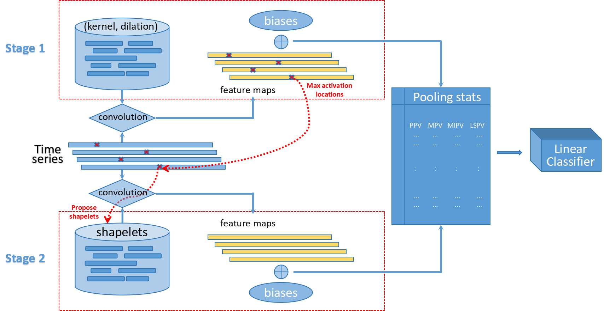

# FAST: Feature mAp-induced Shapelet Transform

**FAST** is a two-stage framework for time series classification. 

Stage 1 applies a MultiROCKET-style kernel transform to obtain a strong and inexpensive baseline representation. 

Stage 2 harvests candidate shapelets from high-convolution locations from Stage~1 and encodes them using the same pooled statistics (features), retaining only those that improve a label-aware discrimination score over their kernel parents. The result is a compact feature set that augments baseline kernel features with shapelet kernel features. Figure below shows a high-level architecture of FAST.





## Environment

We recommend Python **3.9–3.11**. 


## Quick start

Run a single dataset:

```bash
# from the repo root
python -m run.main --dataset GunPoint --threads 20
```

The output will display:

* Number of features:

  * `kernel_budget_total` (defaults scale as below)
  * `shapelet_budget_total = kernel_budget_total // 2`
* Feature matrix shapes for:

  * **K369** kernels, shapelets, and both
* Final accuracies for:

  * K9 kernels | K9 shapelets | K9 both
  * K369 kernels | K369 shapelets | K369 both

### Useful flags (selected)

* `--dataset NAME` — any UCR/UEA name (downloaded via `sktime.datasets`)
* `--threads N` — Numba threads
* `--include_max_feature {0,1}` — add “max activation” feature
* `--kernel_budget_total INT` — override default kernel budget
* `--shapelet_budget_total INT` — override default shapelet budget


## Reproducibility notes

* **Data**: 109 UCR datasets with official splits; 10 resampling using origianl train/test ratio.

or simply:
```bash
# from the repo root
python -m run.run_resample --threads 20 --also_official_split
```


